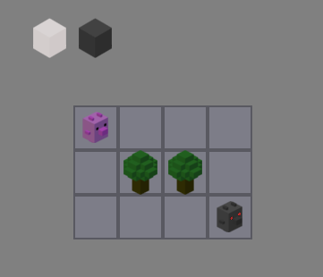
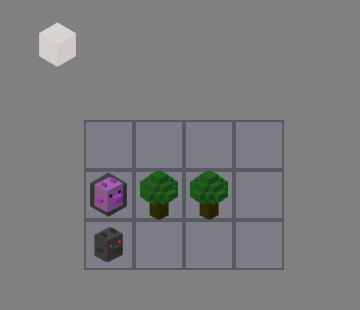

# Cubicforest: Progress Report and Gameplay Rules

A little report on my work on Cubicforest.

Last time I was working on levels resolver. Being surprised by the number of combinations of the possible game courses, I’ve realized, that a class solving levels is necessary.

Let’s say we have a simple level:

The rules of Cubicforest are as follows:

1. Player is moving to any accessible tile, having 3 points of movement. Player can end its movement with building an item.
2. After player the enemy’s movement is taking place (3 points of movement also). It’s AI is simple to pain: every enemy, one after one, is moving to end on a tile nearest to the nearest hero.
3. Player loses if enemy ends its movement on a Player’s tile and wins if every Player’s character has ended movement on a Portal item (which has to be built by a player).

Getting back to the example. Player can end movement by putting one of 2 items or none of them. So the combinations for turns are:

(1) Player’s first turn: player can move on 7 tiles (including the one he’s starting from). He can also put items, so it gives 21 choices on a first turn (7 tiles to move, plus we can put on every tile an item – 7 + 7*2 choices).

(2) Enemy’s first turn: Enemy can move 3 tiles, so if player moved in a first turn more than 2 tiles away, he will loose. Otherwise the game continues.

(3) Assuming that player has not lost, the number of possible choices in a player’s first turn shrinks to 3 fields, so with items we have 3 + 3*2 = 9 choices. Player places a trap, so level after enemies movement could look like this:

(4) Now if player wants to live, he has to move somewhere else. In the next turn enemy will follow its pray, and he will meet a trap and disappear. Player has 3 fields where he can move, plus he can put a portal item (which gives him a victory). So: 6 choices.

With this simple example we can see, that coming up with level riddles is a complicated task, because of the number of available choices in every turn. In above example in first turn player has 9 valid choices, and then 6, or 15 or another number, depending on chosen field and item options. So it gives (very approximately) 54 choices in only two turns. And this is a very simple level, with only 1 player character and one enemy.

Conclusion: testing Cubicforest levels it’s very time consuming. It’s better to be willing to sweat and program a tool, which will check if it’s event possible to win designed level.

Having 60% of the resolver done, I’ve used **Memento design pattern**, to remember level’s every possible objects combinations and to recover any game’s state. In this way Resolver class is looking for every possible combination of player’s moves, but only to some level. I want maps, which can be solved in a reasonable number of turns.

Little demonstration of the current version with commentary:

