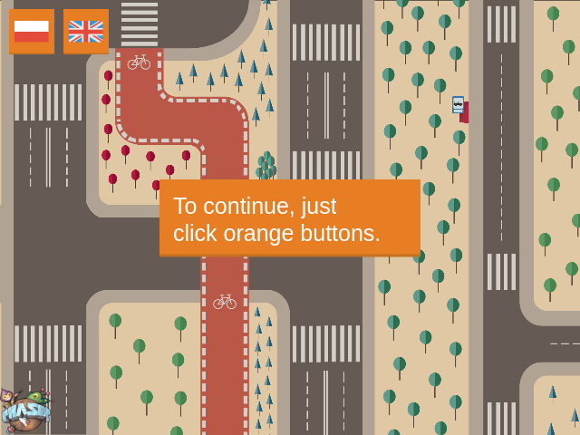

# SafeDrive Project

The project written in Javascript with the Phaser framework http://http://phaser.io/.

The presentation is showing dangerous/illegal traffic situation according to the
Polish traffic law.

Project is published here: http://skobo.pl/safedrive

Source code: https://github.com/adamskopl/safeDrive

All graphics by my Sister Anna Skobodzińska (http://anna.skobo.pl, anna@skobo.pl).

