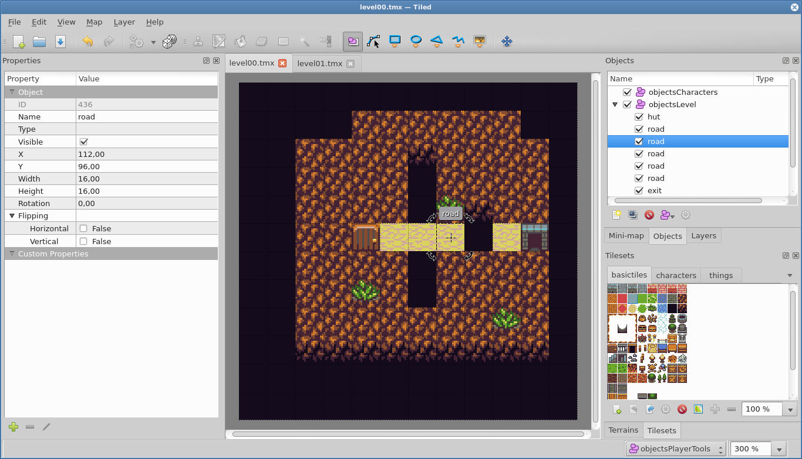

# Cubicforest: Using Tiled

## What is it?

Phaser framework supports loading data about the maps from a couple of formats. As RunPigsRun is not a complicated game with levels built from tiles, Tiled map editor is a sufficient choice.

## How does it work?

First an image presenting a tileset is needed, I’ve got mine from here: http://opengameart.org/content/tiny-16-basic (by: http://opengameart.org/users/sharm). As I’ve mentioned earlier: don’t care how the set looks (although it’s nice). After importing image to program, three types of layers from which level can be built are available:

1. Background Layer. Tiles on this layer are intended to be used as a background: in the game they will be only displayed. Even putting them in editor reminds drawing with a brush.
2. Object Layer. Used to create concrete objects represented by a tile image. Such objects can be translated/rotated. They are named and put into an objects tree. In contrary to Background Layer, created objects are exported with information like: position, id of a tile in a tileset or custom properties (properties set by us).
3. Image Layer. Don’t know, never used it. Probably used to insert an image.



After level is finished, it can be exported to many formats. Some of them are
easily parsed by [Phaser](http://phaser.io/).

## Parsing.

First: loading background. Few lines and we’re good to go: 

```js
// loading map:
this.map = this.game.add.tilemap(
        'level' + this.levelId); 
// loading image for background:
this.map.addTilesetImage(
        'basictiles', assetsConstants.SPREADSHEET_BASIC); 
this.tilemapLayers.push(this.map.createLayer('background0',
        scaleConstants.GAME_W, scaleConstants.GAME_H, 
        this.groupLevels));

```

After that, the image has to be scaled and translated. For these I’m using constants: 


- this.tilemapLayers[i].scale.x = scaleConstants.MAIN_SCALE (scale for every visually measurable number in a game, like distances or object’s dimensions)
- this.tilemapLayers[i].x = scaleConstants.GAME_OFFSET_X * scaleConstants.TILE_SIZE_SCALED (position = map offset in tiles * scaled tile dimensions)

Next: loading objects (like roads or an exit). 

``` js
var objectsLevel = this.map.objects.objectsLevel;
for (var i = 0; i < objectsLevel.length; i++)
        this.gameObjectsManager.create(
                tileObjectToGameObjectParams(
                objectsLevel[i]));
```

Written function tileObjectToGameObjectParams converts loaded Tiled object to my GameObjectParams used to describe object created by a GameObjectsManager. 

## Custom Properties

Right now one object in a game needs an extra attentions: a hut. It has a capacity parameter, which describes how many heroes it will create. Tiled allows to add such ‘Custom Property’ to an object, and later that property if of course shipped along with the other data. 

```js
GameObjectsManagerHuts.prototype.countHeroes = function() {
        var cnt = 0;
        for (var i in this.objects)
                cnt += parseInt(
                this.objects[i].properties.capacity);
        return cnt;
};
```

## In the end

Tiled is a concrete piece of software: does its job very well. An easy and a pleasant way to compose a level with a background and objects. 


