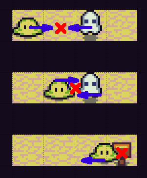

# Collisions Trouble

About lately occurred collision problems.

At first I was satisfied with a first solution for collisions resolving: checking collisions after one movement iteration. What is a movement iteration: a constant time during which objects change their position, normally by moving to the next tile. If an object has a different speed, than it moves at that time a different number of tiles. This ‘movement iteration’ concept gives me more control about game flow: one movement iteration, one positions change for every object.

But lately more situations started coming up. So here are those situations with collisions check implementation explanation. 



First situation shows a variant which was mistakenly assumed to be the only one. Both objects end their movement on one tile. Both are reported to CollisionHandler: 

```js
var GAME_POS = GAME_OBJECT.mov().gamePosTo;
prepareArray(this.tilesToHandle, GAME_POS.x,
        GAME_POS.y);
var ARR = this.tilesToHandle[GAME_POS.x][GAME_POS.y];
(...)
var TILE = this.tilesManager.get(GAME_POS.x, GAME_POS.y);
ARR.push(TILE);
```

 And later every tile is used to make an every to every collision test.

Second situation shows that collisions can occur during movement iteration: when objects are passing each other during normal movement or when one object has bigger speed and passes other object during position change. This forced me to implement something I wanted to avoid: checking collisions on every update(). And this means to get all objects and check every vs every if there are no collisions. 

```js
var collObjects = this.gameObjectsManager.getAllWithout(
[GOT.ROAD, GOT.VOID]);
for (var i = 0; i < collObjects.length; i++)
        for (var j = i + 1; j < collObjects.length; j++) {
                this.game.physics.arcade.overlap(
                collObjects[i].sprite,
                collObjects[j].sprite,
                this.onCollision, null, this);
```

 After that, collected colliding pairs have to be merged in collision groups: one group represents objects which are colliding at the exact moment of time in the same spot. So in the end these groups can be passed to CollisionHandler and handled in the same way as collision between objects ending their movement on the same tile.

Third situation: when object is starting movement from the same position as the position of an another object. It’s not a collision, because collision between those objects was already handled. The difference between those objects positions is calculated: if it’s small enough, it means that during collision check, this collision will be ignored. 
