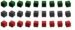
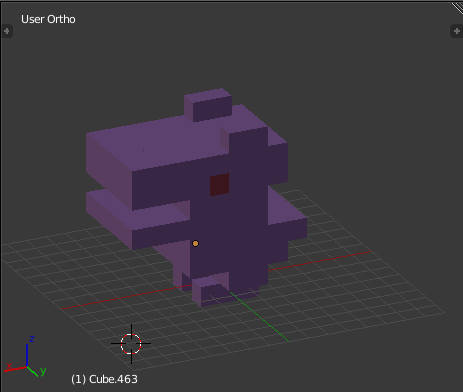
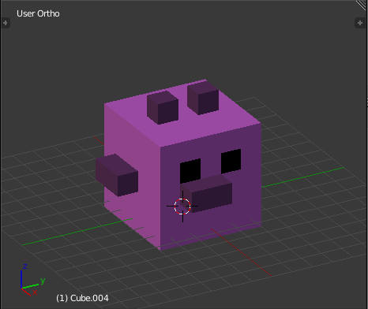
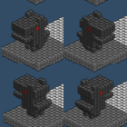
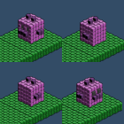

# Cubicforest Models

## Introduction

How the Cubicforest models will be created? It will be an isometric game with models made from cubes. What tools are involved in the process:

- Blender software
- Python scripts
- Cube’s sprites in different colors

## Blender models

As it’s a sin to write tools, which already exist, I’m using Blender software to create 3d models, which are exported to JSON files. By starting with a position [0.0, 0.0, 0.0], cubes are added in Blender one by one, to create a final effect. Positioning is important: as the cubes have constant dimensions, when added next to each other, the exported file gives positions without fractions. It’s important later to easily indicate the order of the cubes for 2d rendering.

## Python script. Json.

Blender allows to interact with the scene with a help of Python scripting. I’ve used it to export model’s data to JSON files. What is exported:

- cubes’ positions
- cubes’ colors

Script will be discussed in another post.

## Colors

I’ve came up with a simple idea of exporting predefined colors. I didn’t succeed with coloring sprites in LibGDX, so I created ready, colored textures. List of colors includes ‘pink’, ‘dark pink’, ‘green’ etc. To keep everything simple the cubes have assigned named materials according to the color they should represent in the game’s world. Later the material names are associated with the according cube sprites.

## 2d sprites

First the 3d positions are sorted into 4 groups: for every angle of the future 2d sprite’s model. Depending on the angle, the group starts with the cube which is farthest (from the camera) and ends with the nearest one. 3d Positions are then mapped into isometric ones and painted onto texture one by one.

From the bottom layer of the model to the top. After that the sprite is saved: the final look is ready.

## Effects

Blender models:

Rendered sprites:

