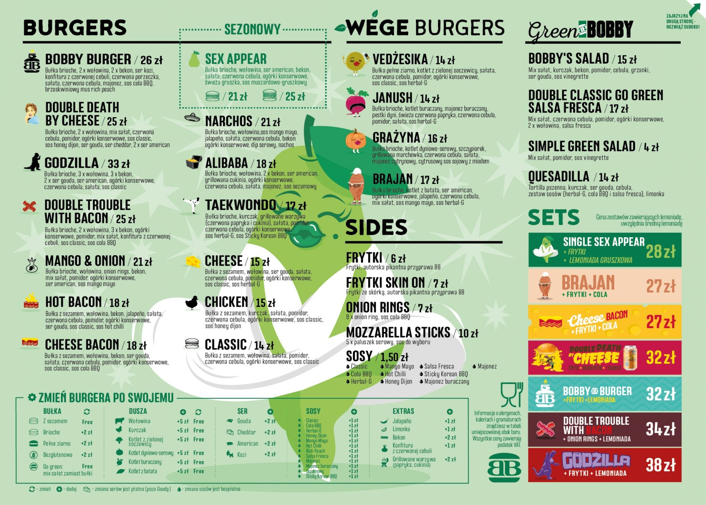
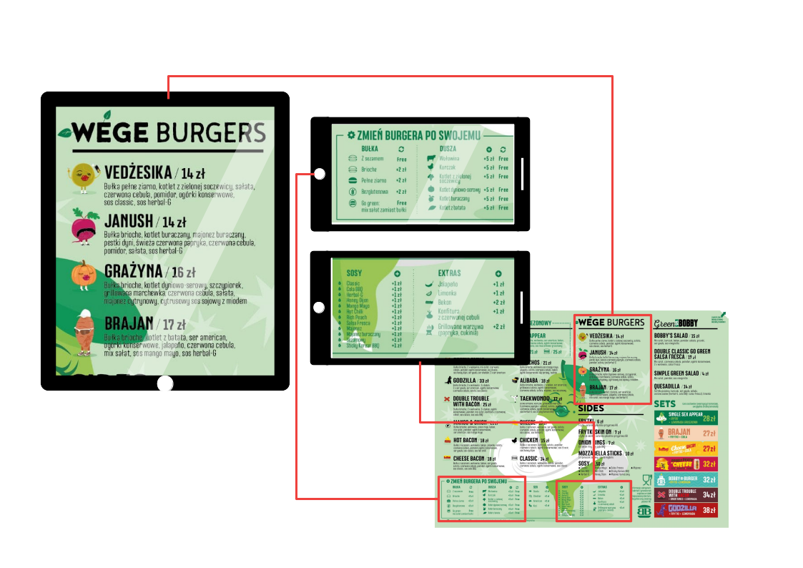

# "Multiscreen Content Display" Project
## Introduction

An aim of this post, is to present an idea for a "Multiscreen Content Display"
software project: how will it work, what problems will it solve, what devices
will it run on.

Resulting software and it's source code will be available publicly. Ongoing work
reports will be published on this blog.

## The project

Goal of the MCD is to allow a user to choose some content (e.g. an image, video
or external webpage) and then display that content's chosen areas in multiple
web browsers run on different devices. A good example could be a restaurant
menu[1]:

User would be able to display menu's different sections on different devices'
browsers. For example tablet with a running browser could display "VEGE BURGERS"
section and smartphones could do the same with other menu's areas.

(ANOTHER CASE: stock market)

(set from the editor)

(Once set ... devices will remember/save ... configuration... and display proper
areas whenever neded/after restart...)

(ANOTHER CASE)
- easy synchronization/scaling/adjusting of content between devices'
- done from one place

## Technical details

## Summary

SUMMARY. What probles solved:
- 
- 

## Footnotes

[1] menu from https://bobbyburger.pl/
