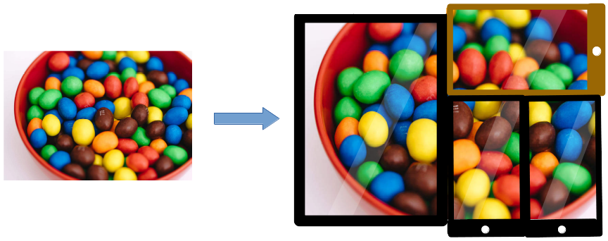

# "Multiscreen Content Display" Project
## Introduction

An aim of this post, is to present an idea for a "Multiscreen Content Display"
software project.

Resulting software and it's source code will be available publicly. Ongoing work
reports will be published on this blog.

## The project
### Goal

Goal of the MCD is to allow a user to display content's (e.g. an image or
external webpage) chosen areas in multiple web browsers run on different
devices. The devices' physical positions and sizes are taken into account. Setup
created by the user will be saved and easily restored.

A good example could be a restaurant menu[1]:

User will be able to display menu's different sections on different devices'
browsers. For example tablet with a running browser could display "VEGE BURGERS"
section and smartphones could do the same with other menu's areas.

Another use case could involve displaying whole content on an area created by
multiple devices:

[2]

### Usage
#### Editor

The project will include an editor, to which target devices (browsers) will
connect. Connected devices will be visualized on the chosen content.

Editor will allow the user to:
* choose a content to be displayed
* arrange displays (what area should given display show?)
* scale displays (zooming displays in/out)

Adjusting devices' properties (position, scale) relative to the content, will be
also possible through each browser involved. In that way, user will be allowed
to create desired setup by interacting with an editor or target devices.

[3]

#### Setup

1. Using the editor, user creates a new display project. Project's web link is
   created.
2. Content is chosen. It could be an image or a web page.
3. User opens project's web link using target devices' browsers. At this stage
   browsers display chosen content, but they need and adjustment.
4. Devices are visualized in the editor. User modify their positions and size
   relatively to the content, so that physical devices will display desired
   areas of the content.
5. After the setup, editor or any of the devices' browsers can be closed and
   opened again. The once created content and devices setup will be restored for
   every device.

## Issues
### Differences in physical properties

Devices have some differences causing some problems:
- physical dimensions 
- [pixel ratio](https://developer.mozilla.org/en-US/docs/Web/API/Window/devicePixelRatio)

Event if screens have the same physical width and height, the different pixel
displaying characteristics may cause the same image to be displayed with
different dimensions There's no way to programmatically get rid of that problem.
It will have to be done manually, but such calibration will have do be done only
once.

### Synchronization

Synchronization between the editor and devices will be needed. Examples:
- different content is chosen, devices should refresh
- position of a device is changed in the editor: device's display should be
  adjusted

As the project is web based, a bidirectional communication between browsers and
the server is needed.

## Summary

"Multiscreen Content Display" will allow to display a chosen content using
multiple devices. With the ability of choosing positions of content's fragments
and their scale, different effects could be achieved. Arranging devices in
different configurations could either expose content's fragments or allow to
display content's fragments using multiple devices, thus creating bigger display
surfaces.

## Footnotes

[1] menu from https://bobbyburger.pl/
[2] https://picjumbo.com/tasty-mms-peanut-chocolates/
[3] https://pixelbuddha.net/freebie/touch-gestures-icons
