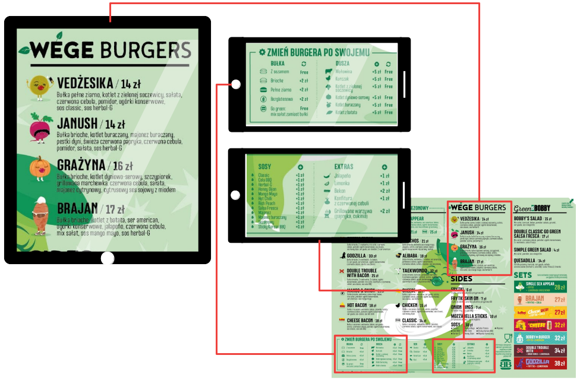

# "Multiscreen Content Display" Project
## Introduction

An aim of this post, is to present an idea for a "Multiscreen Content Display"
software project: how will it work, what problems will it solve, what devices
will it run on.

Resulting software and it's source code will be available publicly. Ongoing work
reports will be published on this blog.

## The project
### Goal

Goal of the MCD is to allow a user to display content's (e.g. an image or
external webpage) chosen areas in multiple web browsers run on different
devices.

A good example could be a restaurant menu[1]:

User will be able to display menu's different sections on different devices'
browsers. For example tablet with a running browser could display "VEGE BURGERS"
section and smartphones could do the same with other menu's areas.

Another use case could involve displaying whole content on an area created by
multiple devices:

[2]

### Usage

The project will include an editor, to which target devices (browsers) will
connect. This will allow the user to:
* choose a content to be displayed
* arrange displays (what area should given display show?)
* scale displays (zooming displays in/out)

Adjusting devices' properties (position, scale) relative to the content, will be
also possible through target browsers. In that way, user will be allowed to
create desired setup by interacting with an editor or target devices.

[3]

(set from the editor)

(Once set ... devices will remember/save ... configuration... and display proper
areas whenever neded/after restart...)

(ANOTHER CASE)
- easy synchronization/scaling/adjusting of content between devices'
- done from one place

## Technical details?

## Summary

SUMMARY. What probles solved:
- displaying sections of a content on multiple devices
- displaying content on a bigger area by combining multiple devices

## Footnotes

[1] menu from https://bobbyburger.pl/
[2] https://picjumbo.com/tasty-mms-peanut-chocolates/
[3] https://pixelbuddha.net/freebie/touch-gestures-icons
